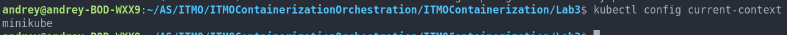
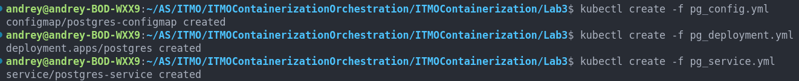
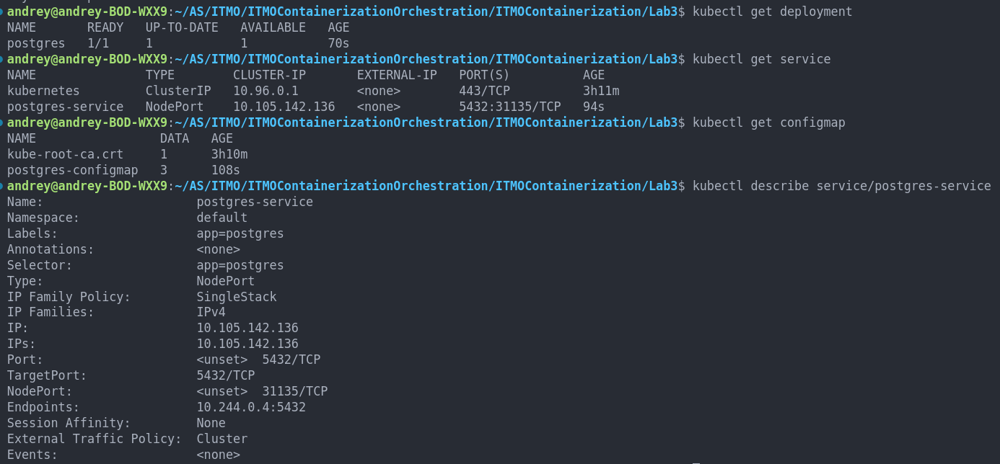
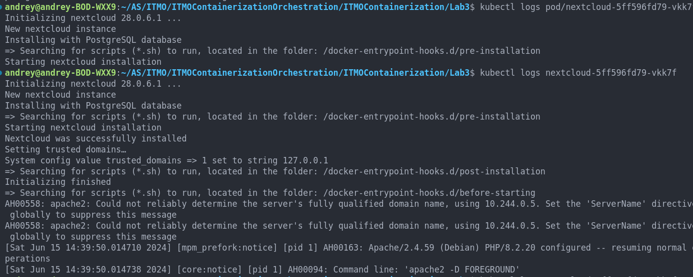
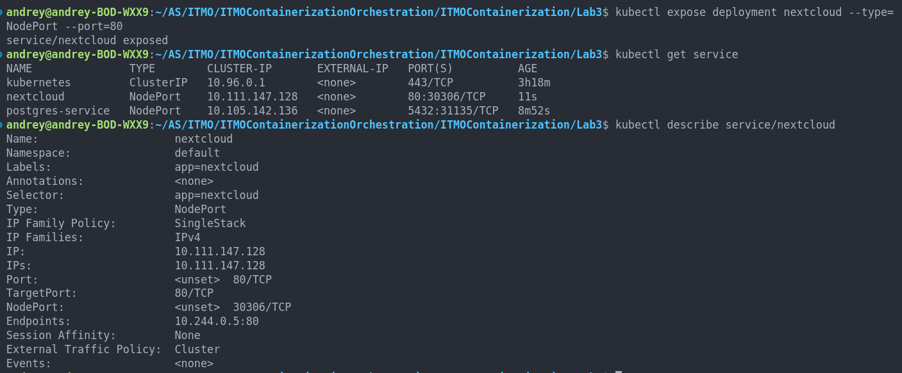
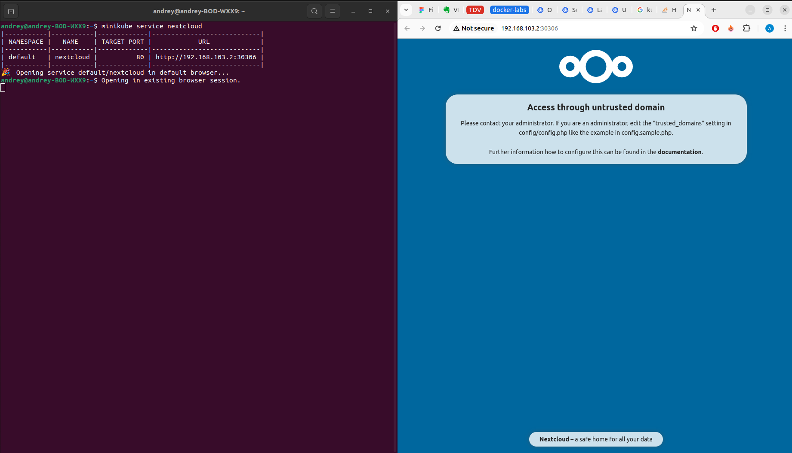
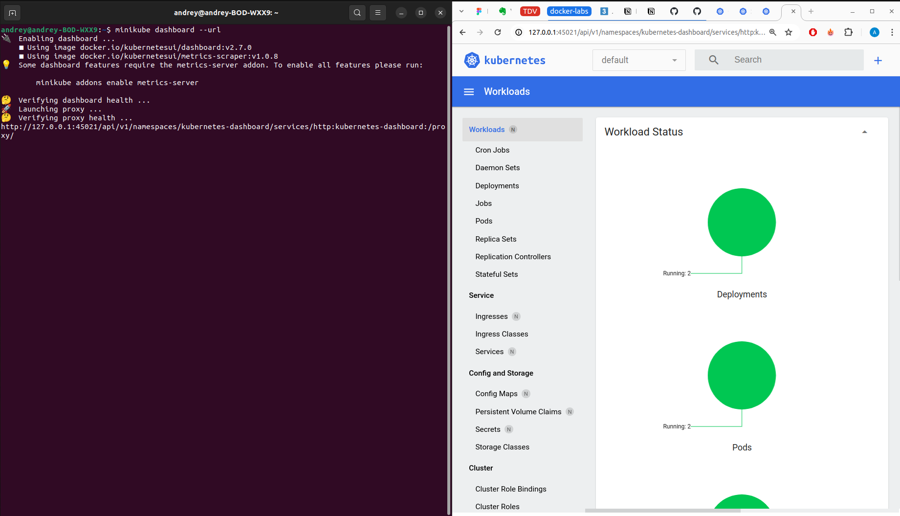
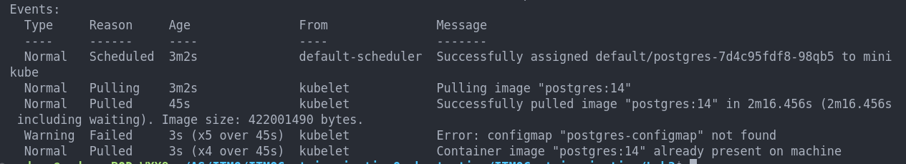
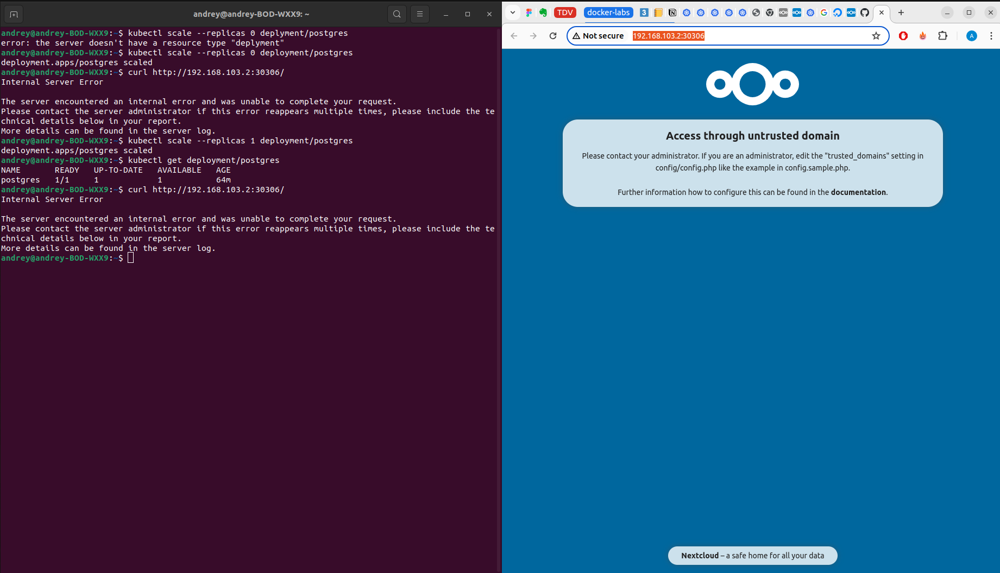

# Отчет по третьей лабораторной работе 

## Выполнение заданий 

### Проверка установки minikube и kubectl 
<details>



</details>

### Создание объектов kubernetes 

<details>

создание



проверка существования




</details>

Деплой nextcloud 

<details>

проверка инициализации nextcloud 



создание сервиса 



подключение 



</details>

### Дэшборд 


<details>



</details>


## Выполнение требований  

### Для постгреса перенести `POSTGRES_USER` и `POSTGRES_PASSWORD` из конфигмапы в секреты (очевидно, понадобится новый манифест для сущности Secret) 

Добавлен новый секрет   
`pg_secret.yml`

Он используется в деплойменте в секции envFrom 
```yaml
    - secretRef:
        name: postgres-secret
```

### Для некстклауда перенести его переменные (`NEXTCLOUD_UPDATE`, `ALLOW_EMPTY_PASSWORD` и проч.) из деплоймента в конфигмапу (очевидно, понадобится новый манифест для сущности ConfigMap)

Добавлена конфиг мапа  
`nextcloud_config.yml` 

Она используется в деплойменте nextcloud в секции envFrom 

```yaml
envFrom: 
- configMapRef:
    name: nextcloud-configmap
```


### Для некстклауда добавить `Liveness` и `Readiness` пробы 

Добавлены пробы который пингуют порт 80, не нашел в nextcloud какой то специальный endpoint для healthcheck поэтому для примера просто пингуется по пути /  

```yaml
livenessProbe:
    httpGet:
    path: /
    port: 80
    initialDelaySeconds: 3
    periodSeconds: 3

readinessProbe:
    httpGet:
    path: /
    port: 80
    initialDelaySeconds: 3
    periodSeconds: 3
```

## Ответы на вопросы 

### Вопрос: важен ли порядок выполнения этих манифестов? Почему?

Да, если между объектами есть зависимости. Например если попробовать создать деплоймент который использует конфигмапу которой нет, то получим такую ошибку 

<details>



</details> 


### Вопрос: что (и почему) произойдет, если отскейлить количество реплик postgres-deployment в 0, затем обратно в 1, после чего попробовать снова зайти на Nextcloud? 

Из-за того, что не был использован volume, данные будут потеряны, что не позволит снова подключиться к nextcloud

<details>



</details>