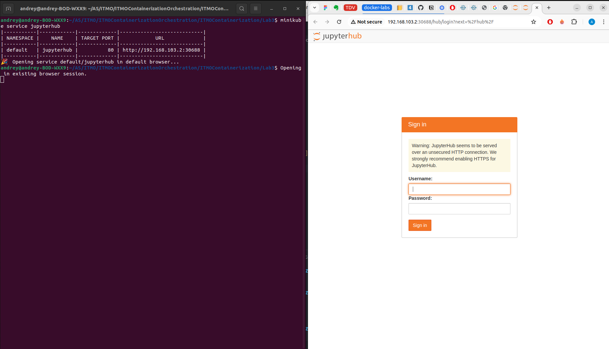

# Отчет по 4 лаборатрной работе 

## Описание приложения 

В данной работе по аналогии со работой 2 контейнеризуется связка jupyterhub + postgres 

## Ход работы  

1. Подготовка докер образа для jupyterhub

```
docker build -f ./good_Dockerfile -t lab4_image .
minikube image load lab4_image
```

2. Разворачивание jupyterhub 

```
kubectl apply -f postgres.yml  
kubectl apply -f jupyterhub.yml
```

3. Проверка работы 

```
minikube service jupyterhub
```

<details>



</details>


## Соответствие требованиям 

### минимум два `Deployment`, по количеству сервисов

Для jupyterhub и postgres созданы отдельные деплойменты

### кастомный образ для минимум одного `Deployment` (т.е. не публичный и собранный из своего *Dockerfile*)

jupyterhub разворачивается на основе кастомного образа, в ходе работы его сборка является первой задачей 

### минимум один `Deployment` должен содержать в себе контейнер и инит-контейнер

Не придумал полноценного юзкейса для инит контейнера в этом примере, поэтому для jupyterhub реализован dummy инит контейнер  

### минимум один `Deployment` должен содержать `volume` (любой)

Для postgres используется персистентный volume 

### обязательно использование `ConfigMap` и/или `Secret`

Используется довольно много конфигмап и секретов, например данные для доступа к базе данных postgres, хранятся в секрете `jupyterhub-db-secrets`

### обязательно `Service` хотя бы для одного из сервисов (что логично, если они работают в связке)

Используется 2 сервиса

`database-service` является энтрипоинтом к базе данных для jupyterhub 

через сервис `jupyterhub` осуществляется доступ пользователя 

### `Liveness` и/или `Readiness` пробы минимум в одном из `Deployment`

Для jupyterhub реализована livenessProbe которая отправляет GET запрос на ендпоинт /hub/api 

### обязательно использование лейблов (помимо обязательных `selector/matchLabel`, конечно)

Деплоймент jupyterhub помечен лейблом  hub_src: custom, для того, чтобы сделать акцент на том, что используется кастомный образ jupyterhub

```
labels:
    app: jupyterhub
    hub_src: custom
```